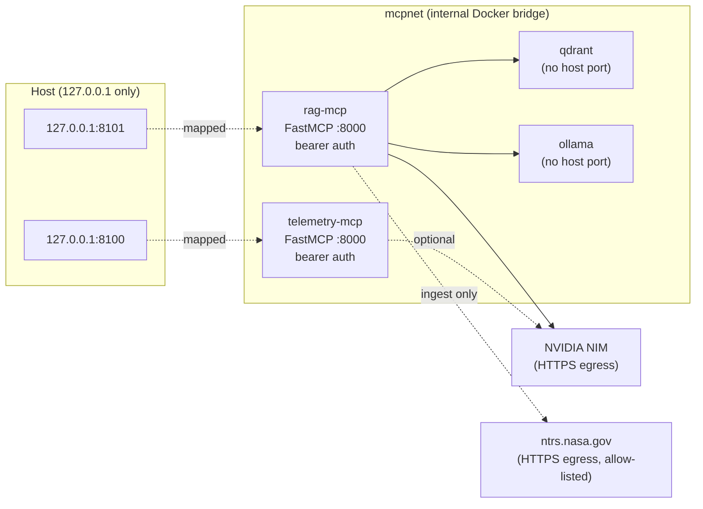
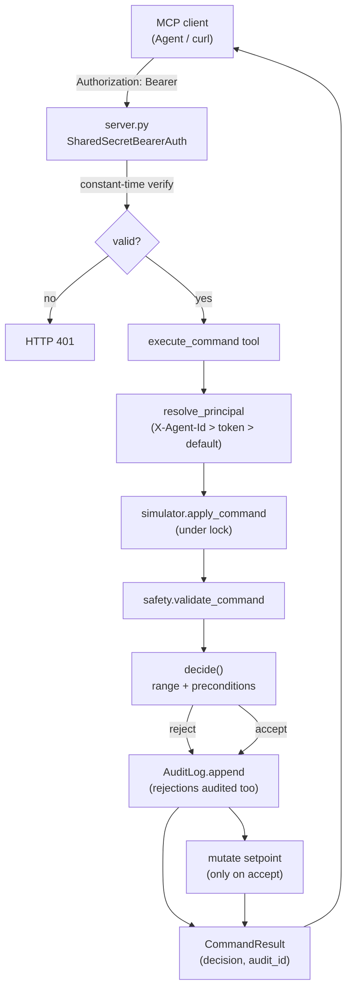
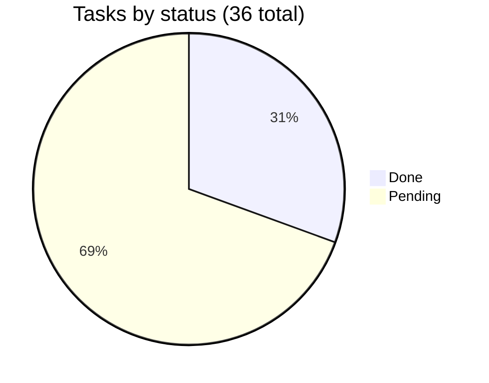
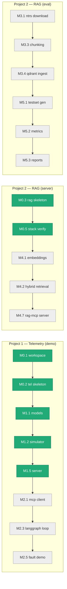

# Project Status

> Single source of truth for the **objective** and **current status** of the
> `langchain-RAG-test` monorepo. Updated as tasks complete. For the full vision
> and locked tech stack see `tasks/PLAN.md`; for the per-task breakdown see
> `tasks/README.md`.

---

## 1. Objective

A single repository containing **two complementary, production-minded MCP
server projects** that together demonstrate (a) agentic AI for high-stakes
control systems and (b) rigorous, evaluated RAG engineering. Both projects
ship as **FastMCP servers**, run together locally via Docker Compose on the
loopback interface only, and share a `uv` workspace monorepo.

| Project | Domain | What it proves |
|---|---|---|
| **P1 — Telemetry MCP & Agent** | Simulated particle-accelerator control | Safe agentic actuation: interlocks, audit log, human-in-the-loop gate, prompt-injection hardening on a cyclic LangGraph loop. |
| **P2 — RAG MCP & Evaluation** | NASA NTRS technical reports (PDFs) | Enterprise RAG discipline: hybrid retrieval + reranking, RAG-as-MCP, and a quantitative Ragas evaluation harness with redacted reports. |

**Non-goals (explicitly out of scope, `PLAN.md` §9):** cloud/k8s deployment,
real accelerator data, multi-tenant auth, internet/LAN exposure of any service.

---

## 2. Architecture schema

### 2.1 Repository layout

```
langchain-RAG-test/
├── README.md                  # top-level overview + quickstart
├── STATUS.md                  # this file
├── tasks/
│   ├── PLAN.md                # full vision, tech stack, milestones, security
│   ├── README.md              # per-task breakdown with dependencies
│   └── M{0..6}-*/             # 36 task specs grouped by milestone
├── pyproject.toml             # uv workspace root (shared dev deps)
├── uv.lock                    # committed lockfile
├── docker-compose.yml         # qdrant, ollama, telemetry-mcp, rag-mcp
├── .env.example               # secrets + ports + image tags (placeholders)
├── projects/
│   ├── telemetry-mcp/         # Project 1 (src/ + agent/ + tests/)
│   └── rag-mcp/               # Project 2 (src/ + evaluation/ + data/ + tests/)
└── packages/                  # (optional) shared utilities
```

### 2.2 Service topology (Docker Compose, localhost-only)



**Security invariants:** every host port binds to `127.0.0.1`; Qdrant and
Ollama have **no** host port; both MCP servers require a bearer token on every
call; outbound egress is limited to NVIDIA NIM and `ntrs.nasa.gov`.

### 2.3 Project 1 — telemetry data flow (command path)



---

## 3. Tech stack (locked, `PLAN.md` §2)

| Concern | Choice | Pin |
|---|---|---|
| Language / runtime | Python 3.11+, `uv` workspaces | `>=3.11` |
| MCP framework | FastMCP (HTTP/SSE) | `3.4.4` |
| Agent orchestration (P1) | LangGraph | `1.2.9` |
| MCP client adapter | langchain-mcp-adapters | `0.3.0` |
| RAG framework (P2) | LangChain | — |
| Vector DB (P2) | Qdrant (hybrid dense + sparse/BM25) | `v1.12.5` |
| Reranker (P2) | BGE-Reranker (local, FastEmbed/HF) | — |
| Evaluation (P2) | Ragas (synthetic test set + metrics) | — |
| Dataset (P2) | NASA NTRS technical reports (PDFs) | — |
| Embeddings (P2) | Ollama local (`bge-m3` / `nomic-embed-text`) | `0.4.0` |
| Chat / agent LLM | NVIDIA NIM (OpenAI-compatible) | — |
| Data validation | pydantic v2 (strict, `extra="forbid"`) | `2.13.4` |
| Lint / test / types | ruff + pytest + mypy (strict) | `0.15.21` / `9.1.1` / `2.2.0` |
| Containerization | Docker + docker-compose (pinned tags) | — |

---

## 4. Milestone progress

```
M0  Scaffolding          [██████████] 5/5  100%  DONE
M1  Telemetry MCP server [████████░░] 6/7   86%  IN PROGRESS
M2  Telemetry agent      [░░░░░░░░░░] 0/5    0%  NOT STARTED
M3  RAG ingestion        [░░░░░░░░░░] 0/4    0%  NOT STARTED
M4  RAG retrieval + MCP  [░░░░░░░░░░] 0/7    0%  NOT STARTED
M5  Evaluation harness   [░░░░░░░░░░] 0/4    0%  NOT STARTED
M6  Polish & CI          [░░░░░░░░░░] 0/4    0%  NOT STARTED
                         ─────────────────────
                         11/36 tasks  31% overall
```



---

## 5. Per-task status

Legend: `[x]` done & verified · `[~]` in progress · `[ ]` not started

### M0 — Scaffolding (5/5 done)

| # | Task | Deps | Status |
|---|------|------|--------|
| M0.1 | uv workspace root + `uv.lock` | — | [x] |
| M0.2 | telemetry-mcp skeleton + Dockerfile | M0.1 | [x] |
| M0.3 | rag-mcp skeleton + Dockerfile | M0.1 | [x] |
| M0.4 | README quickstart | M0.1 | [x] |
| M0.5 | `uv sync` + `compose config` smoke check | M0.1–M0.3 | [x] |

### M1 — Telemetry MCP server (6/7 done)

| # | Task | Deps | Status |
|---|------|------|--------|
| M1.1 | pydantic subsystems/sensors/commands + `PARAMETER_SPECS` | M0.2 | [x] |
| M1.2 | deterministic simulator state machine + sensor logs | M1.1 | [x] |
| M1.3 | injectable fault scenarios (5 named) | M1.2 | [x] |
| M1.4 | safety interlocks + audit log + `CORRECTIVE_ALLOWLIST` | M1.1 | [x] |
| M1.5 | FastMCP server + bearer auth + input bounding | M1.2, M1.4 | [x] |
| M1.6 | human-in-the-loop gate for non-allow-listed commands | M1.4, M1.5 | [ ] |
| M1.7 | simulator + safety unit tests (coverage gate) | M1.2, M1.4 | [x] |

### M2 — Telemetry agent (0/5)

| # | Task | Deps | Status |
|---|------|------|--------|
| M2.1 | `langchain-mcp-adapters` client | M1.5, M0.2 | [ ] |
| M2.2 | observe/hypothesize/investigate/act/verify nodes | M2.1 | [ ] |
| M2.3 | LangGraph cyclic loop, `TypedDict` state, budget | M2.2 | [ ] |
| M2.4 | prompt-injection hardening (`<observation>` fencing) | M2.3 | [ ] |
| M2.5 | end-to-end fault demo script | M2.3, M1.3 | [ ] |

### M3 — RAG ingestion (0/4)

| # | Task | Deps | Status |
|---|------|------|--------|
| M3.1 | hardened NTRS downloader (allow-list, SSRF) | M0.3 | [ ] |
| M3.2 | LangChain PDF loaders + normalize | M3.1 | [ ] |
| M3.3 | hierarchical parent-child chunking | M3.2 | [ ] |
| M3.4 | Qdrant ingest (child + parent vectors) | M3.3, M4.1 | [ ] |

### M4 — RAG retrieval + RAG-as-MCP (0/7)

| # | Task | Deps | Status |
|---|------|------|--------|
| M4.1 | Ollama local embeddings (bge-m3 + fallback) | M0.3 | [ ] |
| M4.2 | Qdrant hybrid (dense + sparse) + reciprocal-rank fusion | M4.1 | [ ] |
| M4.3 | local BGE-Reranker (FastEmbed/HF) | M4.2 | [ ] |
| M4.4 | parent-chunk expansion for LLM context | M4.2, M3.4 | [ ] |
| M4.5 | NVIDIA NIM OpenAI-compatible client + config | M0.3 | [ ] |
| M4.6 | shared API-key pattern redactor | M0.1 | [ ] |
| M4.7 | RAG FastMCP server: tools, auth, `<context>` fencing, redaction | M4.2–M4.4, M4.6 | [ ] |

### M5 — Evaluation harness (0/4)

| # | Task | Deps | Status |
|---|------|------|--------|
| M5.1 | Ragas `TestsetGenerator` synthetic Q&A | M4.5, M3.4 | [ ] |
| M5.2 | Faithfulness / AnsRel / ContextPrecision scoring | M4.7, M5.1 | [ ] |
| M5.3 | JSON/MD/HTML reports, redacted | M5.2, M4.6 | [ ] |
| M5.4 | `python -m rag_mcp.evaluation.run_eval` CI entrypoint | M5.2 | [ ] |

### M6 — Polish & CI (0/4)

| # | Task | Deps | Status |
|---|------|------|--------|
| M6.1 | README, architecture diagrams, one-command quickstart | M0.4, M6.2 | [ ] |
| M6.2 | single `compose up` brings full stack up & healthy | M1.5, M4.7, M0.5 | [ ] |
| M6.3 | ruff + pytest + mypy gates per project | M0.1 | [ ] |
| M6.4 | green run of the security-auditor subagent | M1.5, M4.7, M6.3 | [ ] |

---

## 6. Critical path



Project 1 and Project 2 are independent after M0 and can be worked in parallel.
The shared redactor (M4.6) is reused by M4.7 and M5.3.

---

## 7. Implementation status by project

### 7.1 Project 1 — `projects/telemetry-mcp/` (P1)

| Module | File | LOC | Status |
|---|---|---:|---|
| Models | `src/telemetry_mcp/models.py` | ~290 | Done — pydantic v2, `SUBSYSTEMS`, `PARAMETER_SPECS` (5 subsystems, 9 parameters), `Command`, `CommandResult`, `AuditEntry`, `Precondition` |
| Simulator | `src/telemetry_mcp/simulator.py` | ~340 | Done — deterministic state machine, ring buffer, thread-safe, scenario hooks, audited `apply_command` (validate + audit + mutate atomically under lock) |
| Scenarios | `src/telemetry_mcp/scenarios.py` | ~196 | Done — 5 named faults: `magnet_quench_drift`, `rf_cavity_overheating`, `cryo_pressure_spike`, `vacuum_leak_cascade`, `psu_ripple`; description-injection guard |
| Safety | `src/telemetry_mcp/safety.py` | ~260 | Done — pure `decide()` + audited `validate_command()`, append-only `AuditLog` (ring + NDJSON sink), `CORRECTIVE_ALLOWLIST` + `is_corrective()`, fail-closed principal |
| Server | `src/telemetry_mcp/server.py` | ~260 | Done — `SharedSecretBearerAuth` (constant-time), 5 MCP tools, `X-Agent-Id` principal resolution, `window_s` bounds, `MCP_AUTH_TOKEN` env fail-fast, `main()` |
| Agent | `agent/graph.py`, `nodes.py`, `mcp_client.py` | stubs | Not started (M2) |

**Tests:** 123 passing (`test_smoke` 7, `test_safety` 30, `test_simulator` 46, `test_server` 40).
**Quality gates:** `ruff check` clean · `mypy --strict` clean (6 source files) · coverage 99% on `simulator.py` + `safety.py` (gate: ≥ 85%).

**MCP tools exposed:**
1. `list_subsystems()` — available subsystems + their parameters
2. `get_status(subsystem)` — aggregated snapshot + health flag
3. `get_sensor_logs(subsystem, window_s, since?)` — recent readings
4. `get_recent_anomalies(window_s, since?)` — pre-flagged outliers
5. `execute_command(subsystem, parameter, value, reason)` — interlocked + audited mutation

### 7.2 Project 2 — `projects/rag-mcp/` (P2)

| Module | File | Status |
|---|---|---|
| `ingest.py`, `chunking.py`, `embeddings.py`, `retrieval.py`, `llm.py`, `config.py`, `server.py` | skeleton stubs (~200–450 bytes each) | Not started (M3/M4) |
| `evaluation/` | not present | Not started (M5) |
| `data/`, `evaluation/reports/` | gitignored | — |

Project 2 is scaffolded (pyproject + Dockerfile + package skeleton) but has
no real implementation yet. It is unblocked as soon as work begins on M3/M4.

---

## 8. Quality gates (current state)

| Gate | Scope | Command | Status |
|---|---|---|---|
| Tests | telemetry-mcp | `uv run pytest projects/telemetry-mcp` | 123 passed |
| Lint | telemetry-mcp src + tests | `uv run ruff check projects/telemetry-mcp` | clean |
| Types | telemetry-mcp src | `uv run mypy projects/telemetry-mcp/src` (strict) | 0 issues (6 files) |
| Coverage | simulator + safety | `pytest --cov=telemetry_mcp.simulator --cov=telemetry_mcp.safety` | 99% (gate: ≥ 85%) |
| Security audit | whole repo | security-auditor subagent (M6.4) | pending (M6) |

---

## 9. What is unblocked next

With M1.1–M1.5 and M1.7 complete, the next tasks ready to start (dependencies satisfied):

| Task | Why it is ready |
|---|---|
| **M1.6** — HITL gate | Depends on M1.4 + M1.5, both done. Adds `is_corrective()` check + HMAC confirmation tokens on top of `execute_command`. |
| **M2.1** — MCP client | Depends on M1.5 + M0.2, both done. The agent can now connect to the running telemetry server via `langchain-mcp-adapters`. |
| **M4.1** — Ollama embeddings | Depends only on M0.3 (done). Project 2 work can begin in parallel with M2. |

---

## 10. How status is tracked

- **Per-task checkboxes** — each `tasks/M{N}-*/0*.md` file has a `Status:` line
  (`[ ]` / `[~]` / `[x]`) flipped when the task is verified against its
  acceptance criteria and verification command.
- **This file** — rolled-up milestone progress and implementation status;
  updated alongside task completion.
- **`tasks/README.md`** — the authoritative task list with dependency edges.
- **Git history** — commits follow an `ADD` / `UPDATE` / `FIX` / `REFACTOR` /
  `DOCS` / `CHORE` verb prefix (per the opencode `commit` skill).
